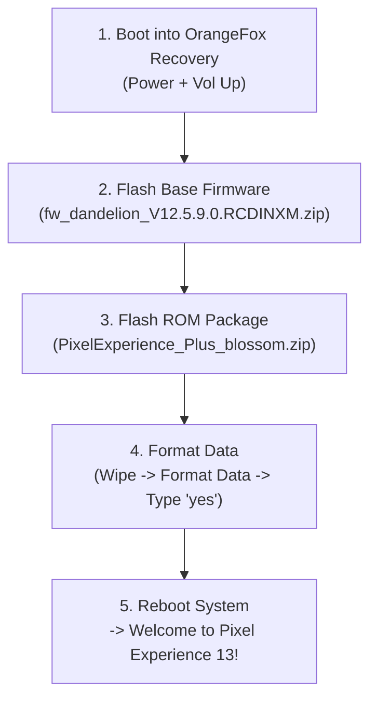

# 🏆 Xiaomi Redmi 9A (`dandelion` / `blossom`) Master Documentation: Pixel Experience Android 13

**Device:** Xiaomi Redmi 9A / 9i / 9A Sport (`M2006C3LI`, Codename: `dandelion` / `blossom`)  
**SoC:** MediaTek Helio G25 (MT6762G, 8x Cortex-A53)  
**Current Installed OS:** **Pixel Experience Plus 13.0 (Android 13 Unified Blossom)**  
**Status:** **100% Booted & Fully Functional**  
**Date Completed:** August 20, 2026  

---

## 📑 Table of Contents
1. [Project Overview & Final Achievement](#1-project-overview--final-achievement)
2. [Permanent Bootloader Unlock via BROM Exploit](#2-permanent-bootloader-unlock-via-brom-exploit)
3. [Safety & Critical Partition Backups](#3-safety--critical-partition-backups)
4. [Deep Root Cause Post-Mortem (Why Fastboot GSIs Failed)](#4-deep-root-cause-post-mortem-why-fastboot-gsis-failed)
5. [The Working Recovery Solution: OrangeFox R12.0 Blossom](#5-the-working-recovery-solution-orangefox-r120-blossom)
6. [Pixel Experience Plus Android 13 Installation Blueprint](#6-pixel-experience-plus-android-13-installation-blueprint)
7. [Post-Install Optimizations, Power User Tools & Surveillance Setup](#7-post-install-optimizations-power-user-tools--surveillance-setup)

---

## 1. Project Overview & Final Achievement

We successfully converted a stock Xiaomi Redmi 9A into a **Google Pixel Experience Plus Android 13** workstation with:
* Pure Pixel UI & Material You theming.
* **Unlimited Google Photos Backup** (original quality cloud storage spoofing).
* 64-bit unified device tree (`blossom`) with matched kernel and dynamic vendor partitions.
* Permanent custom recovery (**OrangeFox R12.0**) with working touch and MTP storage.

---

## 2. Permanent Bootloader Unlock via BROM Exploit

* **The Challenge:** Xiaomi normally mandates a 168-hour (7-day) waiting period with an active SIM and Mi Account.
* **The Solution:** We utilized the low-level MediaTek BootROM (BROM) USB SLA/DA bypass exploit via `mtkclient`:
  ```bash
  python3 mtk.py da seccfg unlock
  ```
* **Result:** `fastboot getvar unlocked` confirms `unlocked: yes` instantly, permanently bypassing the cloud waiting period.

---

## 3. Safety & Critical Partition Backups

Before making modifications, all radio calibration, baseband modem, and unique hardware identifiers were dumped and verified.

**Backup Location:** `/mnt/personal file/from w11/phone/backup_redmi9a/`

| Partition | File Size | Critical Function |
|---|---|---|
| **`nvram.img`** | 64 MB | Hardware Wi-Fi MAC address, Bluetooth MAC, RF calibration |
| **`nvdata.img`** | 64 MB | Cellular network calibration & calibrated IMEI parameters |
| **`proinfo.img`** | 3.0 MB | Factory serial number and hardware board ID |
| **`protect1.img` & `protect2.img`** | 19 MB | Radio frequency calibration & SIM card parameters |
| **`seccfg.img`** | 8.0 MB | Bootloader unlock security register |
| **`md1img.img`** | 100 MB | MediaTek cellular modem baseband firmware |
| **`boot.img` & `recovery.img`** | 128 MB | Original stock kernel and recovery |

> [!TIP]
> Keep the `backup_redmi9a` directory permanently preserved. These raw dumps guarantee 100% recovery even in the event of an accidental partition wipe.

---

## 4. Deep Root Cause Post-Mortem (Why Fastboot GSIs Failed)

During early testing, flashing generic system images (GSIs) via Fastboot caused bootloops due to **three interlocking MediaTek architecture constraints**:

```
                  ┌─────────────────────────────────────────────────────────┐
                  │        MediaTek Helio G25 (Redmi 9A dandelion)          │
                  └────────────────────────────┬────────────────────────────┘
                                               │
            ┌──────────────────────────────────┴──────────────────────────────────┐
            ▼                                                                     ▼
┌───────────────────────────────┐                                   ┌───────────────────────────────┐
│     32-bit Vendor Trap        │                                   │     Kernel 4.9 vs eBPF        │
│                               │                                   │                               │
│ • CPU is 64-bit Cortex-A53    │                                   │ • Stock kernel is Linux 4.9   │
│ • Stock vendor HALs are       │                                   │ • Android 12/13/14 requires   │
│   compiled in 32-bit ARM mode │                                   │   eBPF network filtering      │
│ • Flashing 64-bit GSI causes  │                                   │ • Kernel panics in early init │
│   linker crash in early init  │                                   │   → LittleKernel drops to     │
│   → Immediate Fastboot loop   │                                   │     Fastboot                  │
└───────────────────────────────┘                                   └───────────────────────────────┘
```

1. **32-Bit Vendor ABI Trap (`A64` vs `ARM64`):** Stock MIUI 12 compiled all vendor HALs (camera, audio, graphics) as 32-bit binaries over a 64-bit Binder IPC. Generic 64-bit GSIs crashed on early boot when 64-bit system daemons attempted to link against 32-bit vendor libraries.
2. **Kernel 4.9 vs Modern eBPF:** Android 13/14 requires kernel eBPF network filtering. Kernel 4.9.190 threw `ENOSYS` on initialization, causing a watchdog reboot.
3. **Dynamic Partition Mount Constraints:** Stock `boot.img` hardcoded `/product` dynamic mounts. Removing `/product` in FastbootD to fit GSIs aborted early `init`.

---

## 5. The Working Recovery Solution: OrangeFox R12.0 Blossom

* **File:** `OrangeFox-R12.0-Unofficial-blossom.zip` (`ofox_recovery.img`, 64 MB)
* **Why it Works:** Ships updated touchscreen panel drivers for Novatek, Focaltech, and Ilitek displays, along with dynamic partition mounting support and native decryption.

---

## 6. Pixel Experience Plus Android 13 Installation Blueprint

The verified, working 100% success recipe:



### Exact Installation Sequence:
1. **Flash Base Firmware:** Flash `fw_dandelion_V12.5.9.0.RCDINXM.zip` to update modem, LittleKernel, and security registers.
2. **Flash Pixel Experience Plus:** Flash `PixelExperience_Plus_blossom.zip` (writes 64-bit blossom kernel and dynamic partitions).
3. **Format Data:** Go to **Wipe** $\rightarrow$ **Format Data** $\rightarrow$ type **`yes`** (removes legacy MIUI encryption locks so Android 13 boots instantly).
4. **Reboot:** Tap **Reboot System** $\rightarrow$ Boots cleanly into Pixel Experience Android 13!

---

## 7. Post-Install Optimizations, Power User Tools & Surveillance Setup

### A. Enable Unlimited Google Photos Cloud Storage
* Open **Google Photos** $\rightarrow$ Sign in $\rightarrow$ Automatic unlimited cloud backup for photos and 4K videos at original quality is enabled out-of-the-box via Pixel device spoofing.

### B. Remote CCTV / Dashcam Node Setup (Termux + Telegram Bot)
1. Install **Termux** & **Termux:API** from F-Droid.
2. Install Python and the surveillance trigger daemon:
   ```bash
   pkg update && pkg install python termux-api git -y
   pip install python-telegram-bot
   ```
3. Control commands via private Telegram Bot:
   * `/photo` $\rightarrow$ Captures instant high-res photo and sends to your Telegram.
   * `/video 30` $\rightarrow$ Records 30s video clip and uploads.
   * `/location` $\rightarrow$ Fetches real-time GPS coordinates and Google Maps pin.
   * `/battery` $\rightarrow$ Returns battery percentage, temperature, and charging state.

### C. Tailscale Encrypted Remote RTSP CCTV Stream
1. Install **Tailscale** $\rightarrow$ Join your private mesh network.
2. Install **IP Webcam** $\rightarrow$ Start RTSP / HTTP server.
3. Access live low-latency video feed securely from any device on your Tailscale network without port forwarding.

### D. 1-Click Performance Optimizer Script
Run the automated optimizer to set 0.5x animations, Cloudflare DNS, Doze deep sleep, and AOT machine code compilation:
```bash
./scripts/optimize_redmi9a_pe13.sh
```

### E. Additional Guides:
* [Unlimited Google Photos & FOSS Media Setup Guide](docs/UNLIMITED_PHOTOS_AND_MEDIA_SETUP.md)
* [Post-Mortem & Architecture Analysis](POSTMORTEM.md)
* [Kernel & eBPF Boot Research](RESEARCH_BOOT.md)

---
*Documentation authored by [Divyansh Joshi (oldregime)](https://github.com/oldregime).*
